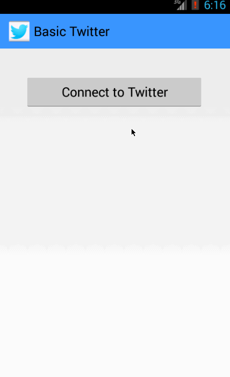

Android training project 5: Twitter With Fragments
==========================

This is an Android application of a simple Twitter client that supports switching 
between user timeline and mention views, composing a new tweet, view user own 
profiles, and check other user's profile while click on the other's profile image.

Time spent: 8 hours spent on basic requirements. (3 hours on video walkthrough, 
5 hours on all other features + debugging.) 

Completed user stories:
 * [x] Required: All required user stories from the previous project
 * [x] Required: User can switch between Timeline and Mention views using tabs.
    * User can view their home timeline tweets.
    * User can view the recent mentions of their username.
    * User can scroll to bottom of either of these lists and new tweets 
      will load ("infinite scroll").
 * [x] Required: User can navigate to view their own profile
    * User can see picture, tagline, # of followers, # of following, and tweets on 
      their profile.
 * [x] Required: User can click on the profile image in any tweet to see another 
       user's profile.
    * User can see picture, tagline, # of followers, # of following, and tweets of 
      clicked user.
    * Profile view should include that user's timeline

Walkthrough of all user stories: 

GIF created with [LiceCap](http://www.cockos.com/licecap/).
